# What is this about?

An Elm implementation of the little language "Arith" described in  *Types and Programming Languages,* Chapter 3.

Arith is a very simple language, providing only three terms:

- `true`
- `false`
- and the natural number `0`

The operations you can perform are:

- `succ` for getting the next term
- `pred` for getting the previous term
- `iszero` to check if the term is in fact zero

The last superpower you are provided with is the `if then else` construct.
That is all!

Here's an example of an Arith expression:

```
if iszero succ 0
  then succ succ succ 0
  else false
```

Which could be represented by this graph:



## Code

- **Term.elm:** the function `parse : String -> Result (List Parser.DeadEnd) Term`

- **Interpreter.elm:** the function `eval : Term -> Value`

- **TypeCheck.elm:** the function `typeCheck : Term -> Maybe Type_`

- **Utility.elm:** the functions `depth, nodeCount, stringValue`.
Convenient, but not needed for the above

- **Main.elm:** a headless Elm app for implementing a repl

- **repl.js:** a Javascript program which sets up communication between `Main.elm` and the console.

## Docs

- Lesson 1
- Exercises

## Operation of the repl

```
$ cd src
$ sh make.sh
$ node repl.js

> succ succ 0
2

> succ succ false
Not typable
```


## References

- *Types and Programming Languages*, by Benjamin Pierce
- Medium article: [Parsing](https://medium.com/@jxxcarlson/implementing-the-mini-language-arith-in-elm-a522f9a7101) on Arith and implementation of a parser for it in Elm.
- Medium article: [Type checking](https://medium.com/@jxxcarlson/type-checking-the-mini-language-arith-in-elm-c752e3e77a97)
