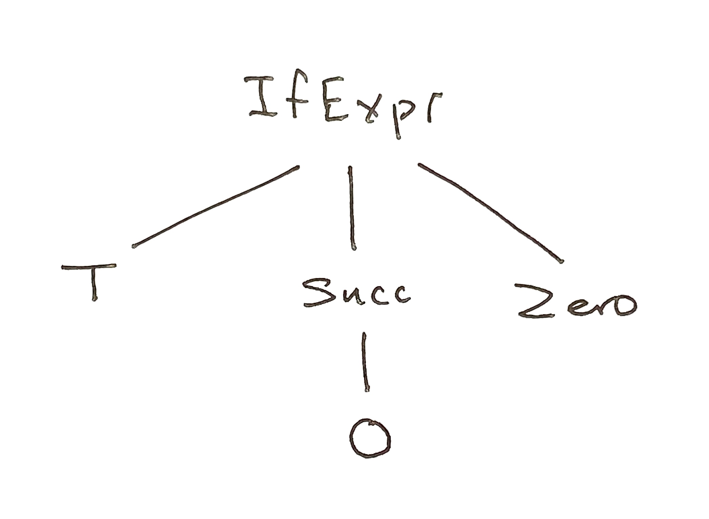

# Lesson 1

## Introduction

Parsers are used to "read" a piece of text and turn it into some kind of data structure.  For example, we can design a parser `date` that takes a string like "31/12/1954" and turns it into the record

```
    { day = 31, month = 12, year = 1954}
```

A parser is a thing that has to be "run" on some input, like this:

```
    > run date "31/12/1954"
    Ok { day = 31, month = 12, year = 1954 }
        : Result (List DeadEnd) Date"
```
Running a parser yields a value of type `Result a b`, where `a` is a list of errors and in this case `b` is `Date` — the thing we want.  This type is needed because when a parser is run, it can either succeed or fail.  When it succeeds, it yields something of type `b`.  Otherwise, it yields an error message. In the example just given, the parser "succeeds".  But of course it can fail if the input does not have the right form:

```
    > run date "31//12/1954"
    Err [{ col = 4, problem = ExpectingInt, row = 1 }]
```

It is not hard to decode the error message.  The input is a piece of text in which each character is located by its row and column address.  In this case, there is just one row. The character in column four is `/`.  This is the second slash of a double slash.  But in a valid date, another integer follows first slash.  So there is a problem: `ExpectingInt`.

### A metaphor

You can think of a parser as a little machine that chomps away at its input string one character at a time, building up its result as it goes. Each time it chomps, it asks "is this the character I expect?" If the answer is *yes*, it keeps going. If the answer is *no* it stops and returns an error message.  If the answer is never no, the parser consumes all of the input that it needs and returns its result.  

To clarify this point, consider the parser

```
    int : Parser Int
```

First, we do this:

```
    > run int "123"
    Ok 123 : Result (List DeadEnd) Int
```
This is what we expect.  Here is another test:

```
    > run int "123abc"
    Ok 123 : Result (List DeadEnd) Int
```

In this case, the `int` parser ate the characters 1, 2, 3, stopping at the character a, then returning `Ok 123`.  But consider this:

```
    > run int "abc123"
    Err [{ col = 1, problem = ExpectingInt, row = 1 }]
```

Our little machine was disappointed by the very first input character, which was not one of the digits 1, 2, ..., 9.  

### About the types

The type of our as-yet-to-be constructed `date` parser is `Parser Date`.  We also have

```
    run : Parser a -> String -> Result (List DeadEnd) a
```

Therefore `run date` has type `Result (List DeadEnd) a`. It is important to get to know the types of the parsers that you use, and to find the types resulting from combining parsers, as we will do below.


### A more elaborate example

For a more elaborate example, consider this sentence in the toy language `Arith`:

```
    if true then succ 0 else 0
```

When parsed, it is transformed into the data structure

```
    IfExpr T (Succ Zero) Zero)
```

While it may not look like it, this data structure is a tree, a so-called *abstract syntax tree*, or *AST*, as in the figure below. One of the jobs of a compiler is to compute AST's for the text of a program, then translate that tree into machine code.   



To summarize, parsers are used to construct functions

```
    f : Text -> Some Structure
```

The structure can be a date, and abstract syntax tree, etc.

## Primitive parsers

Parsers typically operate by reading a stream of characters one at a time, building up the structure as they go, eventually returning either the desired structure or an error.  Let's do an example with the primitive parser `int`.  A primitive parser is one that is given to us by the parser package — we don't have to construct it ourselves.  The `int` parser will read valid characters from its input and return either an integer or an error.  Let's see how this works (see the setup instructions if need be).
Start the Elm repl, then import the `elm/parser` package:

```
$ elm repl
> import Parser exposing(..)
```

Next, run the `int` parser on the string "34". The parser eats the characters 3 and 4 and returns the value `Ok 34`


```
> run int "34"
Ok 34 : Result (List DeadEnd) Int
```

The value, `Ok 34`, is a Result type, meaning that it can be either

```
    Ok (something we want)
```

or

```
    Err (something we don't: an error)
```

Here is an example in which the parser fails:


```
    > run int "thirty-four"
    Err [{ col = 1, problem = ExpectingInt, row = 1 }]
        : Result (List DeadEnd) Int
```

The parser expected a digit, but got the character 't' instead. Let's note the type of our parser:

```
    int : Parser Int
```  

This means that it is a parser whose purpose in life is to eat characters, yielding an integer if successful, and an error if not


### Other Primitive Parsers

Closely related to the `int` parser is `float`, which does what you think it does.  Another primitive is `symbol`, which is used to recognized a given string.  As example, the `symbol "a"` parser recognizes strings
that begin with "a":


```
    > run (symbol "a") "abc"
    Ok () : Result (List DeadEnd) ()
```

It rejects strings that begin with any other character:


```
    > run (symbol "x") "abc"
    Err [{ col = 1, problem = ExpectingSymbol "x", row = 1 }]
        : Result (List DeadEnd) ()
```

Let's note the type signature:

```
    symbol : String -> Parser ()
```

This `symbol` is not actually a parser: it is a function that when given
a string returns a parser.  But a parser of what type? It is of type `()`. This is the *unit type*, a type which has just one value, also called `()`. What kind of information can such a parser give us?  Well, there are just two possibilities. When we run it on an input, it either succeeds, returning `Ok ()`, or fails returning `Err some-error`. Such a parser can tell us about success (recognizing a string, or "symbol") or failure (not recognizing it).

### The succeed parser


Here is the type of the `succeed` parser:

```
    succeed : a -> Parser a
```

When run, it *always* succeeds, returning the value *a*.

```
    > run (succeed 1234) "foo"
````

Thus `succeed 1234` will always succeed, returning 1234:

```
    > run (succeed 1234) "foo"
    Ok 1234 : Result (List DeadEnd) number
```

Here is what happens when we apply it to some other values:

```
   > run (succeed 1234) "76"
   Ok 1234

   > run (succeed 1234) "[1, 2, 89]"
   Ok 1234 : Result (List DeadEnd) number
```

No matter what we run it on, `succeed 1234` returns 1234.


## Combinators: selecting among alternatives

Combinators are functions that can be used to build new parsers
by combining existing ones.  Let's look first at the the `oneOf` combinator.  It allows us to select among alternatives.  As an example,
we build a parser which recognizes strings that begin with the letter
"a" or the letter "b":


```
    > run (oneOf [symbol "a", symbol "b"]) "abc"
    Ok ()
```

The `oneOf` parser takes a list of parsers and applies them to the
input one-by-one, beginning with the left-most parser. The combined
parser succeeds if one of its component parsers succeeds.  If none
of them succeeds, it fails.  First another example of success:


```
    > run (oneOf [symbol "a", symbol "b"]) "bbb"
    Ok ()
```

and then an example of failure:

```
    > run (oneOf [symbol "a", symbol "b"]) "ccc"
    Err [{ col = 1, problem = ExpectingSymbol "a", row = 1 },{ col = 1,  
        problem = ExpectingSymbol "b", row = 1 }]
```

Here is the type of the parser we have been using:

```
    oneOf : List (Parser a) -> Parser a
```

Thus `oneOf` is a function that transforms a list of parsers into a single parser.

## Combinators: sequencing

Parsers can also be combined one after another.  We will give the example of a parser for dates, then explain how it works.  First, we define a type for dates:

```
    type alias Date =
        { day : Int
        , month : Int
        , year : Int
        }
```

Whenever we define a record, as we have just done, we also define function that constructs records from data:

```
    Date : Int -> Int -> Int -> Date
```

Because of its role, a function of this kind is called a *constructor*. You can verify the truth of this statement using the repl:

```
    > import Example.Simple exposing(..)
    > Date
    <function> : Int -> Int -> Int -> Date
```

Thus `Date 31 1 2000` constructs the `Date` value that we think of as 31/1/2000, that is, January 31, 2000.  Here is a parser for `Date` values:

```
    date : Parser Date
    date =
        succeed Date
            |= int
            |. symbol "/"
            |= int
            |. symbol "/"
            |= int
```

And here it is in action:


```
    > run date "31/1/2000"
    Ok { day = 31, month = 1, year = 2000 }
```

### How it works

The `date` parser is an example of *parser pipeline*.  We'll give an informal description of how it works, then a more formal one. Reading from the top, the `int` parser tries to eat characters to recognize an integer.  Then the `symbol "/"` tries to eat a character to recognize the slash. And so on and so on.  If the parser is preceded by the symbol `|=`, the parsing result is kept.  If it is preceded by the symbol `|.`, then the parsing result is ignored.  The results that are kept are then fed to the parser  `succeed date` which produce the final date value.
